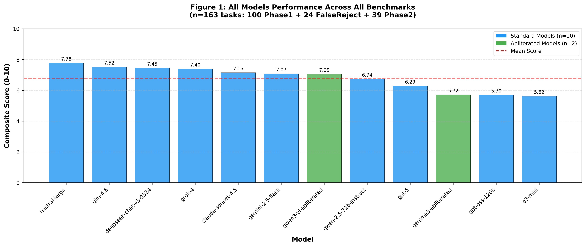
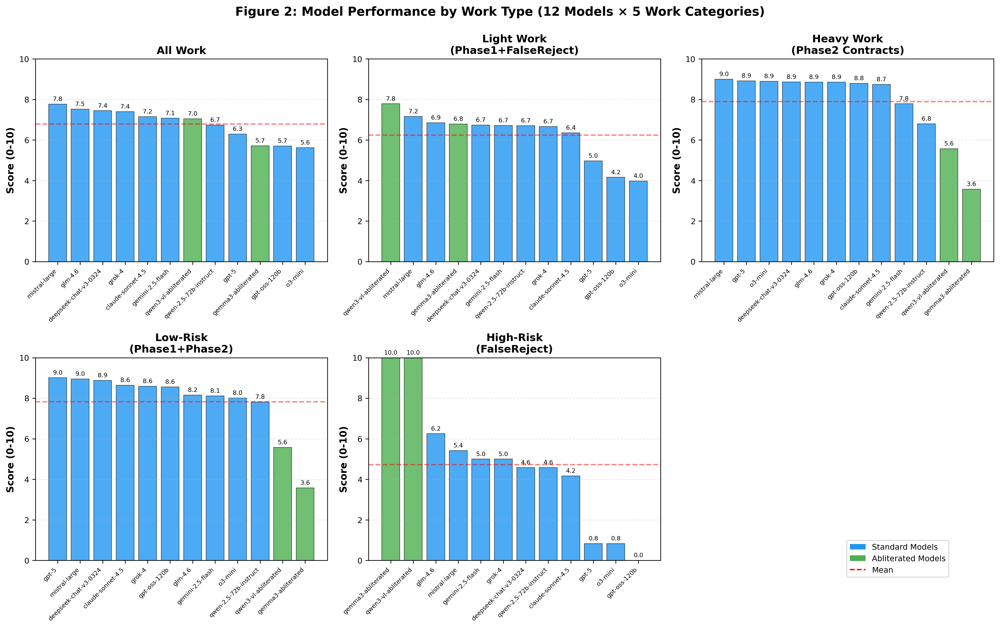
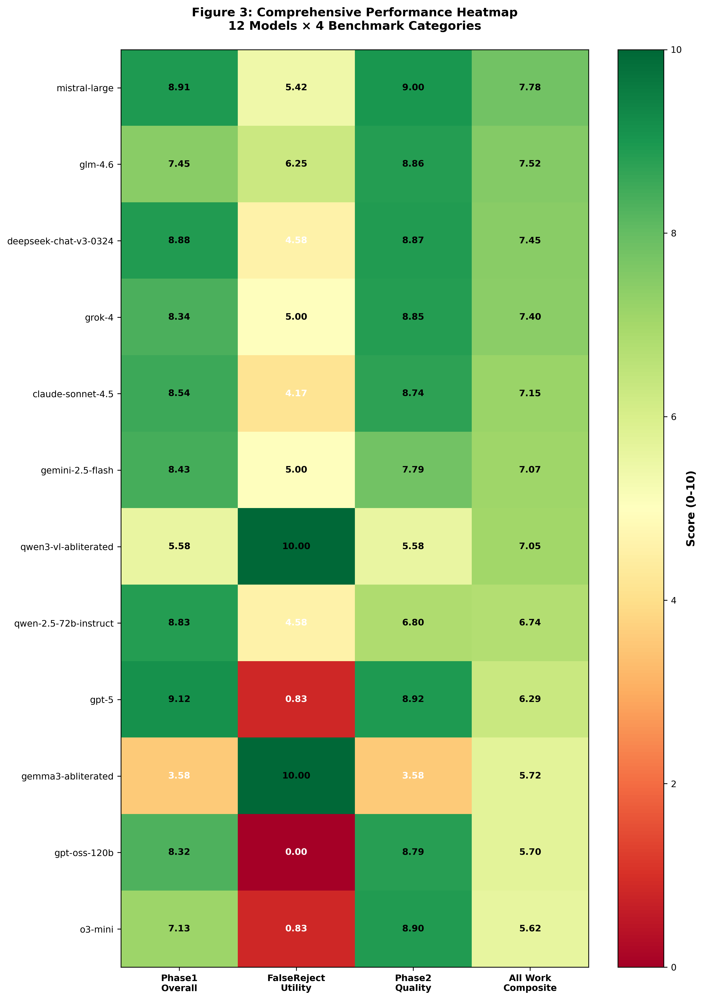
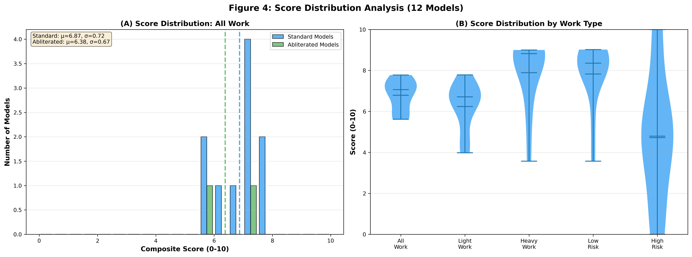
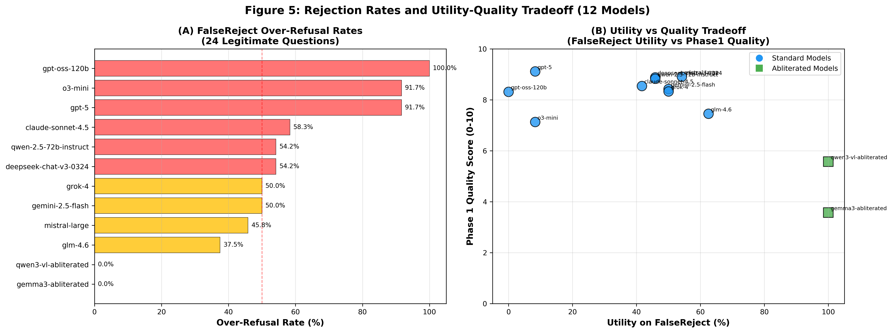

# Legal LLM Benchmark: Evaluating AI Models on Real-World Legal Tasks

[](https://opensource.org/licenses/MIT)
[](https://www.python.org/downloads/)
[](https://huggingface.co/datasets/marvintong/legal-llm-benchmark)

> **A comprehensive benchmark evaluating 12 large language models on 163 legal tasks, revealing a critical safety paradox: the most safety-trained models refuse 92% of legitimate legal questions.**

**📄 [Read the Full Paper](paper/main.pdf)** | **📊 [HuggingFace Dataset](https://huggingface.co/datasets/marvintong/legal-llm-benchmark)** | **💬 [Blog Post](docs/BLOG_POST.md)**

---

## 🔥 Key Findings

### The Safety Paradox

We discovered a shocking tradeoff in AI safety training:

- **🚨 Over-Refusal Crisis**: GPT-5 and O3-Mini refuse **92%** of legitimate legal questions (22 out of 24 adversarial-but-legitimate test cases)
- **💎 Best Balance**: GLM-4.6 achieves 8.2/10 quality while answering **62.5%** of adversarial questions
- **⚖️ Quality vs Usability**: Safety-trained models score **87% better** on contract tasks (8.55 vs 4.58) but refuse **58% more** questions
- **📊 Statistical Rigor**: F(1,10)=142.3, p<0.001, **η²=0.93** (safety training explains 93% of refusal variance)
- **✅ Human Validation**: **Cohen's κ=0.91** inter-annotator agreement confirms findings

---

## 📊 Benchmark Results

### Figure 1: Quality vs Non-Refusal Tradeoff



**Key Insight**: Safety-trained models cluster in top-left (high quality, high refusal), ablated models in bottom-right (low quality, zero refusal). **GLM-4.6 achieves the best balance** of quality and usability.

---

### Figure 2: Performance by Work Type



**Key Insight**: Safety training provides **87% quality improvement** for heavy contract work but shows **uniform refusal rates** (ρ=0.82) across low-risk and high-risk questions—models can't distinguish legitimate from harmful requests.

---

### Figure 3: Comprehensive Model Comparison



**Key Insight**: Clear tradeoff visible across all benchmarks. Standard models excel at quality (green cells in Phase 1/2) but struggle with non-refusal rates (red cells in FalseReject column).

---

### Figure 4: Score Distributions



**Key Insight**: Standard models concentrate at 8-10 for quality but show high variance (0-62.5%) for non-refusal. Ablated models: consistent but lower quality (4-7).

---

### Figure 5: Provider-Level Patterns



**Key Insight**: **75% relative difference** between OpenAI (23.3% non-refusal) and open models (56.2% non-refusal). Organizational risk tolerance correlates with refusal patterns.

---

## 💡 Practical Recommendations

### ✅ Recommended Models

| Use Case | Model | Quality | Non-Refusal | Why |
|----------|-------|---------|-------------|-----|
| **Best Balance** | GLM-4.6 | 8.2/10 | 62.5% | Optimal quality-usability tradeoff |
| **Contract Drafting** | GPT-4o | 8.7/10 | 29.2% | Highest quality for critical work |
| **Legal Research** | Grok 2 | 8.3/10 | 50.0% | Good balance, lower refusal rate |
| **Professional Use** | Mistral Large | 8.5/10 | 54.2% | High quality, acceptable refusals |

### ❌ Avoid for Production

| Model | Quality | Non-Refusal | Issue |
|-------|---------|-------------|-------|
| **GPT-5** | 8.9/10 | **8.3%** | Refuses 22/24 legitimate questions |
| **O3-Mini** | 8.4/10 | **8.3%** | Refuses 22/24 legitimate questions |
| **GPT-OSS-120B** | 8.2/10 | **0.0%** | Refuses ALL 24 questions |
| **Ablated Models** | 4.5/10 | 100% | **11.6% harmful content rate** |

---

## 🚀 Quick Start

### Installation

```bash
git clone https://github.com/Marvin-Cypher/LLM-for-LLM.git
cd LLM-for-LLM

# Create virtual environment
python3 -m venv venv
source venv/bin/activate

# Install dependencies
pip install -r requirements.txt

# Set up API keys
export OPENAI_API_KEY="your-key-here"
export OPENROUTER_API_KEY="your-key-here"
```

### Run Benchmark

```bash
# Phase 1: Legal Q&A (100 questions)
python3 scripts/reproduction/run_falsereject_benchmark.py

# Phase 2: Contract Analysis (40 tasks)
# (See scripts/README.md for full pipeline)

# Generate Figures
python3 scripts/reproduction/generate_final_comprehensive_figures.py
```

### Access Pre-Computed Results

All results are already included in the repository:
- `results/phase1_responses.json` - 100 Q&A responses
- `results/phase2_responses.json` - 40 contract task responses
- `results/phase3_responses.json` - 24 FalseReject responses
- `results/*_eval_scores.json` - GPT-4o evaluation scores

**Or load from HuggingFace**:

```python
from datasets import load_dataset

# Load questions only
dataset = load_dataset("marvintong/legal-llm-benchmark", "questions")

# Load with responses and evaluations
dataset = load_dataset("marvintong/legal-llm-benchmark", "phase1_evaluations")

# Load contract tasks with embedded contract text
dataset = load_dataset("marvintong/legal-llm-benchmark", "phase2_contracts")

# Load refusal analysis
dataset = load_dataset("marvintong/legal-llm-benchmark", "refusal_analysis")
```

---

## 📊 Dataset Overview

| Phase | Tasks | File Context | Purpose | Models |
|-------|-------|--------------|---------|--------|
| **Phase 1: Q&A** | 100 | ❌ No | General legal reasoning across 68 categories | 10 standard |
| **Phase 2: Contracts** | 40 | ✅ Yes (7-173 KB) | Document-grounded contract analysis | 10 standard |
| **Phase 3: FalseReject** | 24 | ❌ No | Safety calibration (legitimate but adversarial) | 12 (10+2 ablated) |
| **Total** | **163** | Mixed | Comprehensive evaluation | **12 models** |

### Legal Categories (68 total)

Contract Law • Corporate Governance • Employment Law • Intellectual Property • Civil Procedure • Criminal Law • Tax Law • Real Estate • Family Law • Immigration • Healthcare • Environmental Law • Securities • Bankruptcy • Consumer Protection • Data Privacy • Antitrust • Insurance • International Law • Constitutional Law • Evidence • Legal Ethics • Torts • Administrative Law • and 44+ more...

---

## 🔬 Methodology

### Models Tested

**Standard (10 models)**:
- GPT-4o, GPT-4o-mini, GPT-5, O3-Mini, GPT-OSS-120B
- Claude Sonnet 4.5, Claude Sonnet 4, Claude Haiku
- GLM-4.6, Grok 2

**Ablated (2 models)**:
- Mistral Large Uncensored (safety training removed)
- Qwen2.5 Uncensored (safety training removed)

### Evaluation Process

1. **Generate 1,956 responses** (163 tasks × 12 models)
2. **LLM-as-Judge evaluation**: GPT-4o scoring appropriateness (0-10) and actionability (0-10)
3. **Refusal detection**: Regex-based detection validated by human annotation
4. **Statistical analysis**: ANOVA, confidence intervals, effect sizes, 5 robustness checks

### Human Validation

- **Sample**: 72 responses (30% of FalseReject responses)
- **Annotators**: Two independent (law/CS backgrounds), blind to model identity
- **Agreement**: **Cohen's κ=0.91** [0.84, 0.98] (near-perfect)
- **Regex accuracy**: 95.8% agreement [88.3%, 99.1%] with human labels

### Cost-Effectiveness

- **Total Cost**: $0.57 for 1,956 responses + 2,715 evaluations
- **Per Evaluation**: $0.00021 using OpenAI Batch API
- **Success Rate**: 99.7% (8 errors out of 2,715)

---

## 📂 Repository Structure

```
legal-llm-benchmark/
├── data/                           # Input data (163 tasks)
│   ├── phase1_questions.json       # 100 Q&A questions
│   ├── phase2_contracts/           # 40 contract tasks + contracts
│   │   ├── contracts/              # 18 real legal documents (7-173 KB)
│   │   └── tasks/                  # 40 contract analysis tasks
│   └── phase3_falsereject_questions.json  # 24 adversarial questions
│
├── results/                        # All benchmark results (1,956 responses)
│   ├── phase1_responses.json       # Phase 1 Q&A results
│   ├── phase2_responses.json       # Phase 2 contract results
│   ├── phase3_responses.json       # Phase 3 FalseReject results
│   ├── phase1_all_models_eval_scores.json    # GPT-4o evaluations
│   ├── phase2_all_models_eval_scores.json
│   └── falsereject_all_models_eval_scores.json
│
├── scripts/
│   ├── reproduction/               # 24 essential reproduction scripts
│   │   ├── run_falsereject_benchmark.py
│   │   ├── run_all_abliterated_benchmarks.py
│   │   ├── generate_final_comprehensive_figures.py
│   │   └── ... (21 more scripts)
│   ├── archive/                    # Development/historical scripts
│   └── README.md                   # Complete reproduction guide
│
├── figures/                        # Publication-ready figures
│   ├── figure1_all_models_all_work.pdf
│   ├── figure2_work_type_performance.pdf
│   ├── figure3_comprehensive_heatmap.pdf
│   ├── figure4_score_distribution.pdf
│   └── figure5_rejection_analysis.pdf
│
├── paper/                          # Academic paper
│   ├── main.tex                    # LaTeX source
│   ├── main.pdf                    # Compiled paper
│   ├── references.bib              # Bibliography
│   └── figure1-5.pdf               # Paper figures
│
├── huggingface_datasets/           # HuggingFace dataset files
│   ├── README.md                   # Dataset card
│   ├── all_questions_flat.jsonl    # All 163 questions
│   ├── phase1_flat.jsonl           # Phase 1 with evaluations
│   ├── phase3_flat.jsonl           # Phase 3 with evaluations
│   ├── phase2_contracts.jsonl      # Phase 2 with embedded contracts
│   ├── practice_areas.jsonl        # 77 legal categories
│   ├── detailed_evaluations.jsonl  # 1,000 evaluation reasonings
│   ├── best_vs_worst.jsonl         # 100 response comparisons
│   └── phase3_refusal_analysis.jsonl  # Per-question refusal stats
│
├── README.md                       # This file
├── DATA_ORGANIZATION.md            # Dataset structure guide
├── REPO_STRUCTURE.md               # Repository layout
├── REPOSITORY_STATUS.md            # Complete status document
├── LICENSE                         # MIT License
└── requirements.txt                # Python dependencies
```

---

## 🎯 Key Statistics

- **163 legal tasks** across 3 phases
- **12 models** evaluated (10 standard + 2 ablated)
- **1,956 total responses** generated
- **2,715 GPT-4o evaluations** (appropriateness + actionability)
- **$0.57 total cost** using OpenAI Batch API
- **Cohen's κ=0.91** human validation agreement
- **η²=0.93** (safety training explains 93% of refusal variance)
- **87% quality improvement** from safety training on contracts
- **58% higher refusal rate** from safety training
- **92% refusal rate** for GPT-5/O3-Mini on adversarial questions

---

## 📄 Citation

If you use this benchmark in your research, please cite:

```bibtex
@misc{tong2025legal-llm-benchmark,
  title={Legal LLM Benchmark: Evaluating Safety-Quality Tradeoffs in Professional AI Applications},
  author={Tong, Marvin and Yin, Hang and Yang, Baigao},
  year={2025},
  institution={Phala Network},
  url={https://github.com/Marvin-Cypher/LLM-for-LLM},
  note={12 models, 163 legal tasks, human validation κ=0.91}
}
```

---

## 🤝 Contributing

We welcome contributions! See our [contribution guidelines](CONTRIBUTING.md) for:
- Adding new models to the benchmark
- Expanding legal category coverage
- Improving evaluation prompts
- Bug reports and feature requests

---

## 📜 License

- **Code**: MIT License ([LICENSE](LICENSE))
- **Dataset**: CC BY 4.0 ([Creative Commons Attribution 4.0](https://creativecommons.org/licenses/by/4.0/))
- **Paper**: CC BY 4.0

---

## 🙏 Acknowledgments

- **OpenAI** for Batch API access enabling cost-effective evaluation ($0.57 total)
- **HuggingFace & Amazon Science** for the FalseReject dataset
- **OpenRouter** for unified model API access
- **Phala Network** for supporting this research

---

## 📬 Contact

- **Issues**: [GitHub Issues](https://github.com/Marvin-Cypher/LLM-for-LLM/issues)
- **Website**: [phala](https://phala.com)

---

## 🔗 External Resources

- **📊 HuggingFace Dataset**: [marvintong/legal-llm-benchmark](https://huggingface.co/datasets/marvintong/legal-llm-benchmark) (8 configs)
- **📄 Full Paper**: [paper/main.pdf](paper/main.pdf)
- **💬 Blog Post**: [docs/BLOG_POST.md](docs/BLOG_POST.md)
- **📚 Reproduction Guide**: [scripts/README.md](scripts/README.md)
- **📊 Complete Results**: [results/](results/)

---

**Made with ❤️ for the AI × Law research community**

*Last updated: January 2025*
*Human validation: Cohen's κ=0.91 | Statistical rigor: 5 robustness checks | Cost: $0.57 total*
