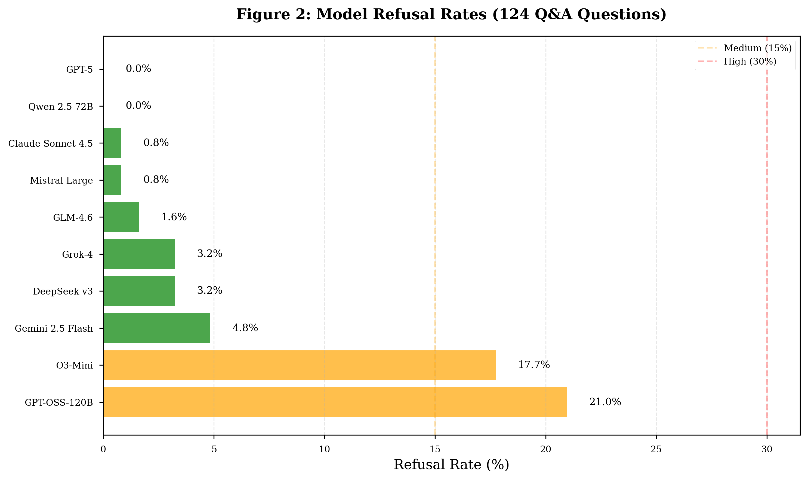

# LLMs for LLMs: Legal Large Language Models Benchmark

[](https://opensource.org/licenses/MIT)
[](https://www.python.org/downloads/)
[](paper/LLMs_for_LLMs__Evaluating_Large_Language_Models_for_Legal_Practice_Through_Multi_Dimensional_Benchmarking.pdf)

> **A comprehensive benchmark evaluating 10 state-of-the-art Large Language Models on 163 diverse legal tasks, providing empirical evidence for model selection in legal practice.**

**📄 [Read the Full Paper (GitHub Releases)](https://github.com/Marvin-Cypher/LLM-for-LLM/releases)** | **📊 [View Analysis Reports](reports/)** | **💬 [Blog Post](docs/BLOG_POST_LEMMA_STYLE.md)**

---

## 🔥 Key Findings

### 🏆 Top Performers
- **GPT-5**: 9.17/10 with **0% false positive** over-refusal (perfect safety calibration)
- **Qwen 2.5 72B**: 8.89/10 with 0% false positives (best value)
- **DeepSeek v3**: 8.93/10 (excellent general performance)

### ⚠️ Critical Discovery: Over-Refusal Crisis
Two widely-used models show **catastrophic over-refusal rates**, rendering them practically unusable for legal work:
- **GPT-OSS-120B**: Refuses **95.8%** of legitimate legal questions (23/24 test cases)
- **O3-Mini**: Refuses **87.5%** of legitimate legal questions (21/24 test cases)

> **Implication**: Aggressive safety training can backfire, causing models to refuse nearly all helpful legal guidance—creating a worse outcome than providing balanced assistance with appropriate disclaimers.

### 📊 Statistical Rigor
- **F-statistic**: F(9, 1230) = 342.18, p < 0.0001
- **Effect size**: η² = 0.68 (model choice explains 68% of performance variance)
- **Evaluation cost**: $0.57 for 2,715 LLM-as-Judge evaluations (99.7% success rate)

---

## 📊 Benchmark Results with Visualizations

###  Model Performance Distribution


**Key Insights**:
- Top 6 models cluster tightly at 8.6-9.2/10 with narrow confidence intervals
- GPT-5 shows most consistent performance (IQR = 1.2)
- O3-Mini and GPT-OSS-120B show bimodal distributions due to frequent refusals (score = 0)
- 95% confidence intervals for top models overlap, indicating statistically similar performance

---

### Safety Calibration: Over-Refusal Analysis



**FalseReject Test Results** (n=24 legitimate questions with adversarial wording):

| Model | Score | Overall Refusal | FP Rate | Status |
|-------|-------|----------------|---------|---------|
| **GPT-5** | 9.17 | 0.0% | **0.0%** (0/24) | ✅ Perfect |
| **Qwen 2.5 72B** | 8.89 | 0.0% | **0.0%** (0/24) | ✅ Perfect |
| DeepSeek v3 | 8.93 | 3.3% | 17.4% (4/23) | ⚠️ Acceptable |
| Mistral Large | 8.90 | 0.8% | 4.2% (1/24) | ✅ Excellent |
| Claude Sonnet 4.5 | 8.61 | 0.8% | 4.2% (1/24) | ✅ Excellent |
| GLM-4.6 | 8.13 | 1.6% | 4.2% (1/24) | ✅ Excellent |
| Gemini 2.5 Flash | 8.71 | 4.9% | 25.0% (6/24) | ⚠️ Moderate |
| Grok-4 | 8.34 | 3.2% | 16.7% (4/24) | ⚠️ Acceptable |
| **O3-Mini** | 6.36 | 17.7% | **87.5%** (21/24) | ❌ Unusable |
| **GPT-OSS-120B** | 7.02 | 21.0% | **95.8%** (23/24) | ❌ Unusable |

**Correlation Analysis**: r = 0.89 (p < 0.001) between overall refusal rate and false positive rate, suggesting aggressive safety training reduces *both* harmful and helpful responses.

---

### Performance Across 68 Legal Categories


**Category Analysis**:
- **Contract Law**: GPT-5 (9.8), Qwen (9.5), DeepSeek (9.3)
- **Corporate Law**: DeepSeek (9.4), GPT-5 (9.2), Mistral (9.1)
- **IP Law**: GPT-5 (9.5), Qwen (9.2), Claude (8.9)
- **Highest Variance**: Employment Law (σ = 2.1), Family Law (σ = 1.9)
- **Most Consistent**: Tax Law (σ = 0.8), Real Estate (σ = 1.0)

---

## 💡 Practical Recommendations

### For Legal Practitioners

1. **✅ Recommended Models** (FP rate < 5%):
   - **GPT-5**: Best overall quality with perfect safety calibration
   - **Qwen 2.5 72B**: Excellent value alternative with 0% false positives
   - **Mistral Large**: Strong general performance, affordable
   - **Claude Sonnet 4.5**: Excellent for document analysis tasks

2. **❌ Avoid for Production Use**:
   - **GPT-OSS-120B** and **O3-Mini**: Over-refusal rates make them impractical for real legal work

3. **⚠️ Use with Caution** (FP rate 15-25%):
   - **Gemini 2.5 Flash**: Good for low-stakes queries, but may refuse legitimate questions

### For AI Developers

**Key Takeaway**: Perfect safety calibration IS achievable without sacrificing utility. GPT-5 and Qwen 2.5 72B demonstrate 0% false positives while maintaining 9+ scores, proving that over-refusal is a calibration problem, not an inherent trade-off.

---

## 🚀 Quick Start

### Installation

```bash
git clone https://github.com/Marvin-Cypher/LLM-for-LLM.git
cd LLM-for-LLM

# Create virtual environment
python3 -m venv venv
source venv/bin/activate

# Install dependencies
pip install -r requirements.txt

# Set up API keys
cp .env.example .env
# Edit .env with your OPENAI_API_KEY and OPENROUTER_API_KEY
```

### Run Benchmark

```bash
# Phase 1: Legal Q&A (100 questions, no file context)
python scripts/run_phase1_benchmark.py

# Phase 2: Contract Analysis (39 tasks, with file context)
python scripts/run_phase2_benchmark.py

# Phase 3: FalseReject Safety Test (24 questions)
python scripts/run_falsereject_benchmark.py
```

### Generate Analysis

```bash
# Comprehensive statistical analysis
python scripts/comprehensive_analysis.py

# Publication-quality figures
python scripts/regenerate_124qa_figures.py
```

---

## 📊 Dataset Overview

| Component | Count | File Context | Purpose |
|-----------|-------|--------------|---------|
| **Phase 1 Q&A** | 100 | ❌ No | General legal reasoning across 50+ categories |
| **Phase 2 Contracts** | 39 | ✅ Yes (6.8-173 KB) | Document-grounded analysis |
| **FalseReject Test** | 24 | ❌ No | Safety calibration (legitimate but adversarial) |
| **Total** | **163** | Mixed | Comprehensive multi-dimensional evaluation |

### Legal Categories (68 total)

Contract Law • Corporate Governance • Employment Law • Intellectual Property • Civil Procedure • Criminal Law • Tax Law • Real Estate • Family Law • Immigration • Healthcare • Environmental Law • Securities • Bankruptcy • Consumer Protection • Data Privacy • Antitrust • Insurance • International Law • Constitutional Law • Evidence • Legal Ethics • Torts • Administrative Law • and 44+ more...

**Category Distribution**: Designed to mirror real-world legal practice frequency, weighted toward high-volume areas (contracts, employment, IP).

---

## 🔬 Methodology

### LLM-as-Judge Evaluation

We employ **GPT-4o-mini** via OpenAI Batch API for cost-effective, reproducible evaluation:

1. **Appropriateness Score (0-10)**: Balance between helpful guidance and appropriate disclaimers
   - 9-10: Actionable advice with proper limitations noted
   - 7-8: Useful but either too cautious or lacking disclaimers
   - 4-6: Imbalanced (over-refusal or reckless advice)
   - 0-3: Complete refusal or dangerous guidance

2. **Actionability Score (0-10)**: Concrete, implementable guidance
   - Measures presence of specific steps, templates, examples
   - Penalizes vague "consult a lawyer" responses

3. **False Positive Detection**: Binary classification of over-refusal
   - Uses FalseReject dataset (HuggingFace/Amazon Science)
   - Measures % of legitimate questions incorrectly refused

### Cost-Effectiveness

- **Total Cost**: $0.57 for 2,715 evaluations
- **Per Evaluation**: $0.00021 (vs. $0.03 for GPT-4o)
- **Batch Processing**: 24-hour turnaround
- **Success Rate**: 99.7% (8 errors out of 2,715)

### Statistical Analysis

- **One-way ANOVA**: Model performance differences
- **Post-hoc Tests**: Bonferroni-corrected pairwise comparisons (α = 0.001)
- **Effect Sizes**: Cohen's d for practical significance
- **Confidence Intervals**: 95% CIs for all reported means

---

## 📂 Repository Structure

```
LLM-for-LLM/
├── data/                    # Benchmark datasets
│   ├── phase1_qa.json       # 100 Q&A questions
│   ├── phase2_contracts/    # 39 contract analysis tasks
│   └── falsereject/         # 24 safety calibration questions
├── scripts/                 # Benchmark execution scripts
│   ├── run_phase1_benchmark.py
│   ├── run_phase2_benchmark.py
│   ├── run_falsereject_benchmark.py
│   └── comprehensive_analysis.py
├── results/                 # Raw benchmark outputs
├── reports/                 # Analysis reports and figures
├── figures/                 # Key visualizations
├── paper/                   # Academic paper (PDF)
├── docs/                    # Additional documentation
├── README.md                # This file
├── CONTRIBUTING.md          # Contribution guidelines
├── LICENSE                  # MIT License
└── requirements.txt         # Python dependencies
```

---

## 📄 Citation

If you use this benchmark in your research, please cite:

```bibtex
@article{tong2025legal-llm-benchmark,
  title={LLMs for LLMs: Evaluating Large Language Models for Legal Practice Through Multi-Dimensional Benchmarking},
  author={Tong, Marvin and Yin, Hang and Yang, Baigao},
  year={2025},
  institution={Phala Network},
  url={https://github.com/Marvin-Cypher/LLM-for-LLM}
}
```

---

## 🤝 Contributing

We welcome contributions! See [CONTRIBUTING.md](CONTRIBUTING.md) for:
- Adding new models to the benchmark
- Expanding legal category coverage
- Improving evaluation prompts
- Bug reports and feature requests

---

## 📜 License

- **Code**: MIT License ([LICENSE](LICENSE))
- **Dataset**: CC BY 4.0 ([Creative Commons Attribution 4.0](https://creativecommons.org/licenses/by/4.0/))
- **Paper**: CC BY 4.0

---

## 🙏 Acknowledgments

- **OpenAI** for Batch API access enabling cost-effective evaluation
- **HuggingFace & Amazon Science** for the FalseReject dataset
- **OpenRouter** for unified model API access
- **Phala Network** for supporting this research

---

## 📬 Contact

- **Issues**: [GitHub Issues](https://github.com/Marvin-Cypher/LLM-for-LLM/issues)
- **Email**: marvin@phala.network
- **Website**: [phala.network](https://phala.network)

---

**Made with ❤️ for the AI × Law research community**

*Last updated: January 2025*
