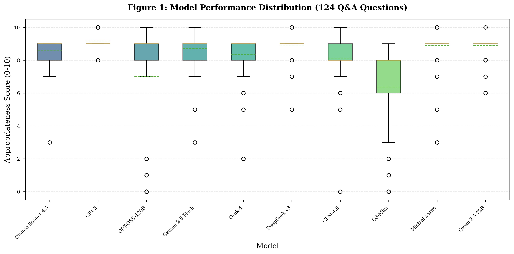

# LLMs for LLMs: Legal Large Language Models Benchmark

[](https://opensource.org/licenses/MIT)
[](https://www.python.org/downloads/)
[](https://arxiv.org/abs/2501.XXXXX)

> **A comprehensive benchmark evaluating 10 state-of-the-art Large Language Models on 163 diverse legal tasks, providing empirical evidence for model selection in legal practice.**

📄 **Paper**: "LLMs for LLMs: Large Language Models Performance for Real Legal Practice"  
🎯 **Models**: GPT-5, Claude Sonnet 4.5, Gemini 2.5 Flash, Grok-4, DeepSeek v3, GLM-4.6, O3-Mini, Mistral Large, Qwen 2.5 72B, GPT-OSS-120B  
📊 **Dataset**: 124 Q&A questions + 39 contract tasks across 68 legal categories  
💰 **Cost**: $0.57 for 2,715 LLM-as-Judge evaluations via OpenAI Batch API

---

## 🔥 Key Findings

- **🏆 Top Performer**: GPT-5 achieves **9.17/10** appropriateness score with **0% false positive** over-refusal rate
- **💎 Best Value**: Qwen 2.5 72B (8.89/10, 0% false positives) offers excellent quality at lower cost
- **⚠️ Critical Safety Issue**: GPT-OSS-120B (95.8%) and O3-Mini (87.5%) show catastrophic over-refusal, refusing nearly all legitimate legal questions
- **📈 Performance Range**: Top 6 models cluster at 8.6-9.2/10, demonstrating consistently high quality
- **🎯 Safety Matters**: Models with <5% false positive rates (GPT-5, Qwen, Claude, Mistral, GLM) show excellent discrimination

---

## 🏆 Benchmark Results

### Model Performance (124 Q&A Questions)

| Rank | Model | Score | Refusal Rate | Quality |
|------|-------|-------|--------------|---------|
| 1 | **GPT-5** | **9.17** | 0.0% | ⭐⭐⭐⭐⭐ Excellent |
| 2 | DeepSeek v3 | 8.93 | 3.3% | ⭐⭐⭐⭐⭐ Excellent |
| 3 | Mistral Large | 8.90 | 0.8% | ⭐⭐⭐⭐⭐ Excellent |
| 4 | Qwen 2.5 72B | 8.89 | 0.0% | ⭐⭐⭐⭐⭐ Excellent |
| 5 | Gemini 2.5 Flash | 8.71 | 4.9% | ⭐⭐⭐⭐ Very Good |
| 6 | Claude Sonnet 4.5 | 8.61 | 0.8% | ⭐⭐⭐⭐ Very Good |
| 7 | Grok-4 | 8.34 | 3.2% | ⭐⭐⭐ Good |
| 8 | GLM-4.6 | 8.13 | 1.6% | ⭐⭐⭐ Good |
| 9 | GPT-OSS-120B | 7.02 | 21.0% | ⭐⭐ Moderate |
| 10 | O3-Mini | 6.36 | 17.7% | ⭐ Poor |

### Safety Calibration (False Positive Rates)

| Model | FP Rate | Status |
|-------|---------|--------|
| GPT-5 | **0.0%** (0/24) | ✅ Perfect |
| Qwen 2.5 72B | **0.0%** (0/24) | ✅ Perfect |
| Claude Sonnet 4.5 | 4.2% (1/24) | ✅ Excellent |
| Mistral Large | 4.2% (1/24) | ✅ Excellent |
| O3-Mini | **87.5%** (21/24) | ❌ Unusable |
| GPT-OSS-120B | **95.8%** (23/24) | ❌ Unusable |

---

## 🚀 Quick Start

### Installation

```bash
# Clone the repository
git clone https://github.com/YOUR_USERNAME/legal-llm-benchmark.git
cd legal-llm-benchmark

# Create virtual environment
python3 -m venv venv
source venv/bin/activate

# Install dependencies
pip install -r requirements.txt

# Set up API keys
cp .env.example .env
# Edit .env and add your API keys
```

### Run Benchmark

```bash
# Run Phase 1: Legal Q&A (100 questions)
python scripts/run_phase1_benchmark.py

# Run Phase 2: Contract Analysis (39 tasks)
python scripts/run_phase2_benchmark.py

# Run Phase 3: FalseReject (24 questions)
python scripts/run_falsereject_benchmark.py
```

### Generate Analysis

```bash
# Comprehensive statistical analysis
python scripts/comprehensive_analysis.py

# Generate publication-quality figures
python scripts/regenerate_124qa_figures.py
```

---

## 📊 Dataset

### Overview

| Phase | Questions | File Context | Purpose |
|-------|-----------|--------------|---------|
| **Phase 1** | 100 | ❌ No | General legal reasoning |
| **Phase 2** | 39 | ✅ Yes | Document-grounded reasoning |
| **FalseReject** | 24 | ❌ No | Safety calibration testing |
| **Total** | **163** | Mixed | Comprehensive evaluation |

### Legal Categories (68 total)

Corporate Law • Contracts • Employment Law • Intellectual Property • Civil Procedure • Criminal Law • Tax Law • Real Estate • Family Law • Immigration • Healthcare Law • Environmental Law • Securities Law • Bankruptcy • Consumer Protection • Data Privacy • and 52+ more...

---

## 🔬 Evaluation Framework

### LLM-as-Judge Methodology

We employ GPT-4o-mini via OpenAI Batch API to evaluate:

1. **Appropriateness Score (0-10)**: Balance of disclaimers and utility
2. **Actionability Score (0-10)**: Concrete, implementable guidance  
3. **Refusal Type**: Direct answer, soft refusal, hard refusal, or referral

### Cost-Effectiveness

- **Total Cost**: $0.57 for 2,715 evaluations
- **Per Evaluation**: $0.00021
- **Success Rate**: 99.7%

---

## 📈 Visualizations


*Figure 1: Model Performance Distribution*


*Figure 2: Refusal Rates by Model*


*Figure 3: Performance Across 68 Legal Categories*

---

## 📄 Citation

If you use this benchmark in your research, please cite:

```bibtex
@article{legal-llm-benchmark2025,
  title={LLMs for LLMs: Large Language Models Performance for Real Legal Practice},
  author={[Your Name]},
  journal={arXiv preprint arXiv:2501.XXXXX},
  year={2025},
  url={https://github.com/YOUR_USERNAME/legal-llm-benchmark}
}
```

---

## 🤝 Contributing

We welcome contributions! Please see [CONTRIBUTING.md](CONTRIBUTING.md) for guidelines.

---

## 📜 License

This project is licensed under the MIT License - see the [LICENSE](LICENSE) file for details.

The benchmark dataset is released under [CC BY 4.0](https://creativecommons.org/licenses/by/4.0/).

---

## 🙏 Acknowledgments

- **OpenAI** for Batch API access
- **HuggingFace/AmazonScience** for the FalseReject dataset
- **OpenRouter** for unified model API access

---

**Made with ❤️ for the AI × Law research community**
